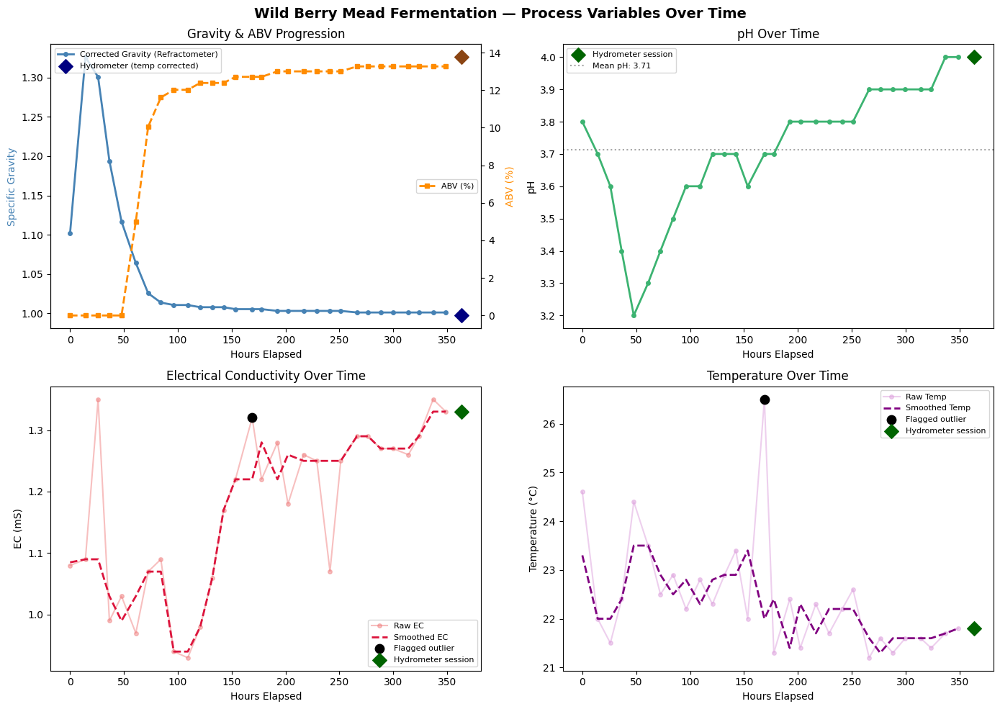
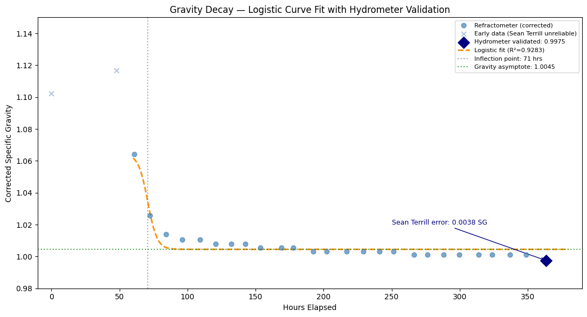
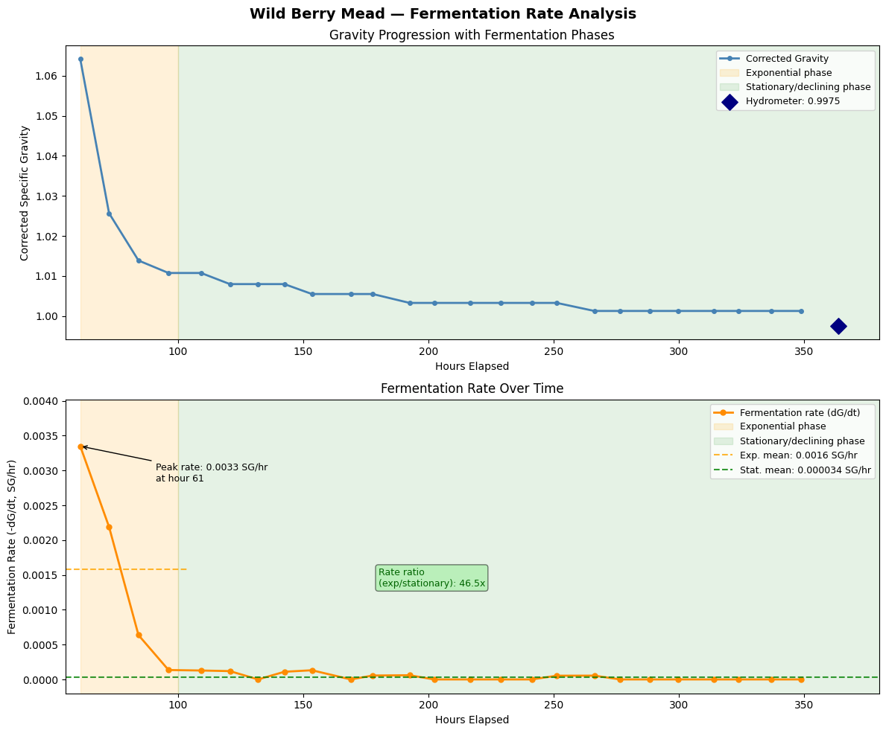
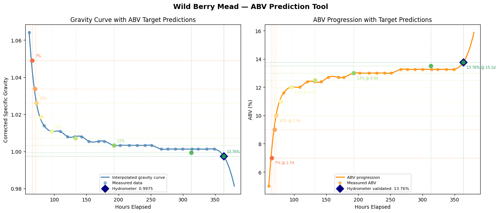

# Wild Berry Mead Fermentation — Kinetics Analysis

A personal fermentation project that doubles as an applied chemical engineering 
study. I foraged wild blackberries and wineberries near my home in Western North 
Carolina, brewed a 1-gallon batch of mead using Red Star Premier Classique yeast, 
and collected multi-variable process data at 12-hour intervals over a 15-day 
fermentation. The resulting dataset was analyzed using a Python pipeline built in 
Google Colab, using techniques relevant to bioprocessing and 
fermentation engineering.

## Key Findings

-    **Final ABV:**   13.76% (validated by hydrometer, corrected for temperature)
-    **Sean Terrill refractometer correction error:**   0.0038 SG units vs. temperature-corrected hydrometer
-    **Peak fermentation rate:**   0.0033 SG/hr at hour 61
-    **Exponential to stationary phase rate ratio:**   46.5x
-    **ABV prediction error:**   0.0% (interpolation model anchored to hydrometer endpoint)
-    **Fermentation monitoring duration:**   363.5 hours (15.1 days)

## Instrumentation

| Instrument | Measurements | Notes |
|---|---|---|
| 0–80% Brix refractometer (ATC) | Brix (raw) | Sean Terrill correction applied after data collection |
| 3-in-1 pen meter | pH, EC (mS), Temperature | Calibrated with pH 4.0 and 7.0 buffers before each session |
| Hydrometer + test jar | Specific gravity | Temperature corrected (0.00013 SG/°F) at endpoint |

Sampling interval: every 12 hours at consistent times throughout fermentation.
Total data points: 31 (30 refractometer + 1 hydrometer endpoint).

## Python Pipeline

The analysis is organized over 7 cells in the Colab notebook:

| Cell | Description |
|---|---|
| 1 | Data loading from Excel, hydrometer temperature correction |
| 2 | Sean Terrill refractometer correction, ABV calculation at each point |
| 3 | IQR outlier detection, contextual pruning, rolling median smoothing of both EC and temp |
| 4 | Time-series visualization of all process variables |
| 5 | Logistic curve fitting to gravity data, hydrometer validation, R² calculation |
| 6 | Numerical differentiation of gravity to identify fermentation phases and rate ratios |
| 7 | ABV prediction tool using cubic interpolation anchored to hydrometer endpoint |

**Libraries:** pandas, numpy, matplotlib, scipy (curve_fit, interp1d)

## Methodology Notes

**Refractometer correction:** Refractometers are calibrated for sucrose solutions and 
produce readings that are artificially high once alcohol is present. The Sean Terrill correction formula 
accounts for alcohol interference using the original and current Brix readings. 
The accuracy of this was validated against a temperature-corrected hydrometer reading at 
fermentation endpoint (error: 0.0038 SG units).

**Outlier handling:** IQR detection flagged rows 0–5 (early fermentation phase) and 
row 14 (thermostat malfunction, days 6–8). Early readings were retained since they were legitimate 
data and represented the lag and exponential growth phases. The thermostat anomaly was 
documented and EC/temperature were smoothed using a 3-point rolling median.

**Phase identification:** Fermentation rate (−dG/dt) was calculated using numpy.gradient 
(central differences method) on the more reliable data range (hour 60+). Exponential and 
stationary phases were identified visually from the rate curve, with a 46.5x rate reduction 
between phases confirming that the fermentation was essentially complete.

**ABV prediction:** The logistic model slightly overestimated the final gravity 
relative to the hydrometer reading. A cubic interpolation approach anchored to the 
hydrometer endpoint was used instead, which produced a prediction error of 0.0% at 
13.76% ABV.

## Results

### Process Variables Over Time

### Gravity Decay — Logistic Curve Fit Validated by Hydrometer

### Fermentation Rate Analysis and Phase Identification

### ABV Prediction Tool

## Recipe

| Ingredient | Amount |
|---|---|
| Wild honey | 2.5 lbs (1134g) |
| Wild blackberries | 0.805 lbs (367g) |
| Wild wineberries | 0.805 lbs (367g) |
| Yeast | Red Star Premier Classique (5g) |
| Yeast nutrient | 1 tsp |
| Water | fill to 1 gallon |

**Starting Brix:** 24.0 | **OG:** 1.1023 | **FG:** 0.9975 | **ABV:** 13.76%
